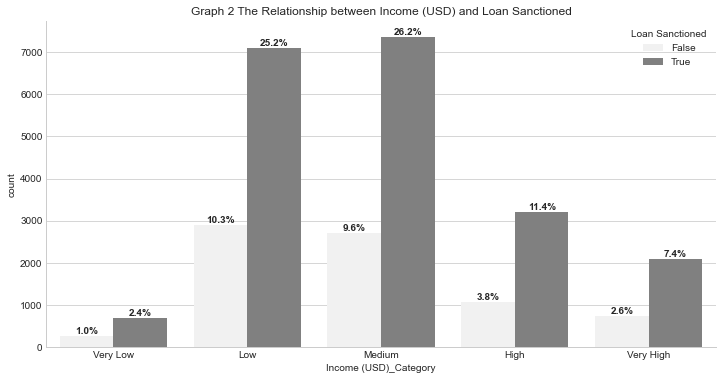
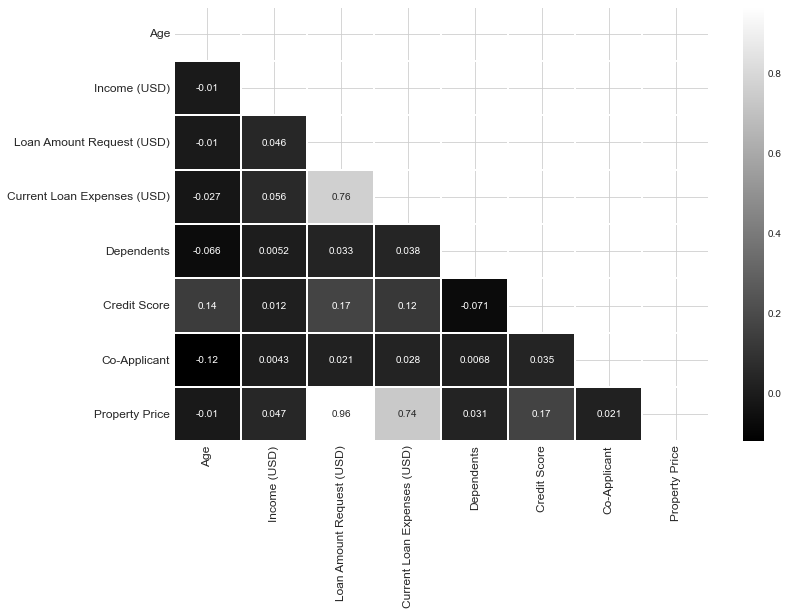
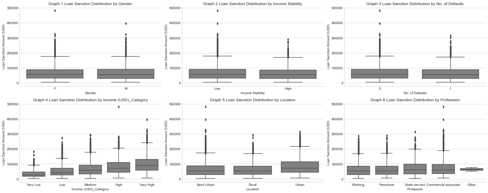
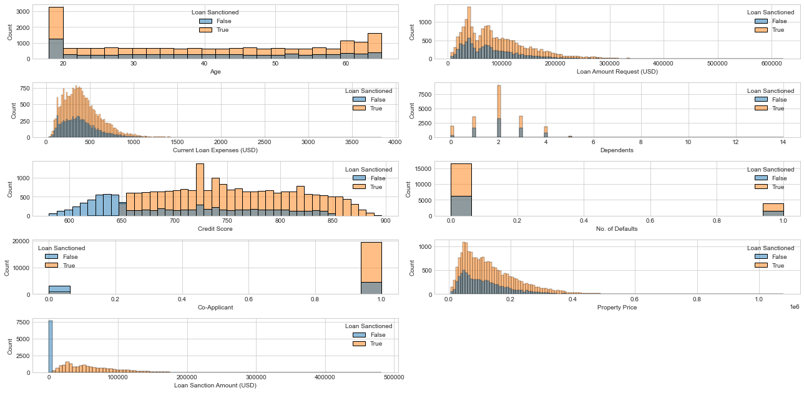
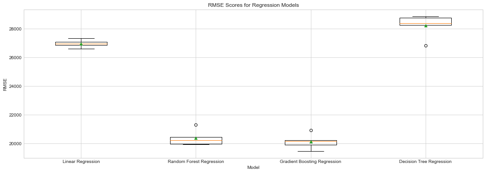
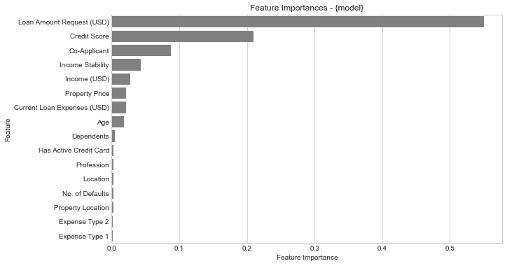
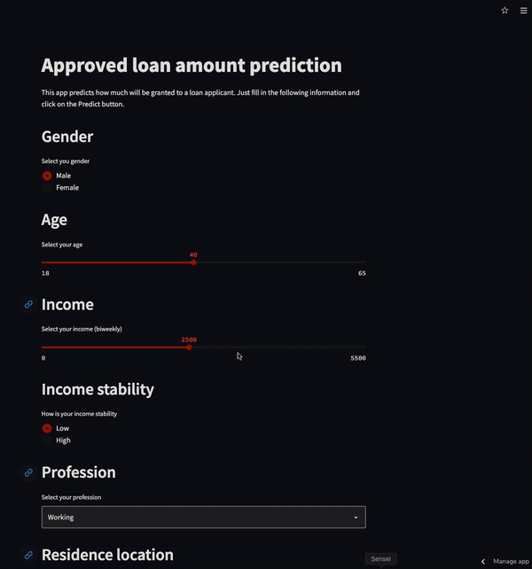

# LOAN PREDICTION APP

[Image by Freepik](href=https://www.freepik.com/)

Key Findings 🏦💲📊:

- Credit scores and co-applicants significantly impact loan approvals.
- Data scaling addresses skewed distribution and zero loan sanctions.
- Income (USD) varies across categories, and balanced correlations exist between gender, income stability, no defaults, and loan sanction amounts. Certain professions and urban locations show higher loan approvals.
- Numeric variables positively correlate with loan sanction, especially more credits and co-applicants. - Little multicollinearity observed; Loan Amount Request and Property Price are reasonably correlated.
- Prioritize predictive features for applicant profiling.

## Authors

- [@Biniam](https://github.com/BiniamBerhe)

## Table of Contents

- [Business problem](#business-problem)
- [Data source](#data-source)
- [Methods](#methods)
- [Exploratory Data Analysis Results](#exploratory-data-analysis-results-📈)
- [Recommendations](#recommendations)
- [Limitation and Improvement to be made](#limitation-and-improvement-to-be-made)
- [Run Locally](#run-locally)
- [Explore the notebook](#explore-the-notebook)
- [Deployment on streamlit](#deployment-on-streamlit)
- [App deployed on Streamlit](#app-deployed-on-streamlit)
- [Contribution](#contribution)
- [License](#license)

## Business problem

Optimize loan approvals and accurate loan amount estimation using applicant profile details (credit scores, co-applicants). Reduce instances of zero loan sanctions, identify key predictive features for profiling, and understand correlations to optimize loan sanction amounts.

## Data source

- [Kaggle loan amount prediction](https://www.kaggle.com/phileinsophos/predict-loan-amount-data)

## Methods

- Exploratory data analysis
- Multivariate correlation
- Model deployment
- UI Integration using Streamlit

## Exploratory Data Analysis Results 📈

    
    

    
    

# Model Performance

Cross validation results

    
    

| Model with the best hyperparameter | RMSE (range between 0 and 400000) |
| ---------------------------------- | --------------------------------- |
| Random Forest                      | 19505.51                          |
| Gradient Boosting                  | 19525.17                          |

- **_The final model used is: Random Forest_**
- **_Metrics used: RMSE_**
- Why choose random forest? while bagging was better in our cross validation result with `RMSE: 95% Confidence Interval: (19342.359, 20763.027) vs Random forest RMSE: 95% Confidence Interval: (19309.774, 20999.564)`, Random forest performed better in our test dataset.

## Recommendations

- Based on the analysis on this project, we found out that the loan amount that will be granted is determined mainly by the loan amount requested, credit score and a co-applicant. The least important features are expenses types and gender.
- Recommendation would be to focus more on the most predictive feature when looking at the applicant profile, and pay less attention on the least predictive features.

## Limitation and Improvement to be made

- The dataset lack a metadata about the features. (What expenses types mean? What does property type 1, 2, 3, 4 mean?)
- Loan Sanction Amount shows a separation between zero and non zero vales, retraining the model with non zero amount showed much better result
- Additional Feature engineering could be done to enhance the dataset

## Usage

The app is available in this link

## For local use

Clone the repository `https://github.com/BiniamBerhe/Loan-prediction-app`
Navigate to the directory and type pip `install  > requirements.txt`.
type streamlit run streamlit_app.py and look for a page in your browser

## Further info

for more info on the code look into the Notebooks provided in Notebooks folder

## License

MIT License

Copyright (c) 2023 Binam

Permission is hereby granted, free of charge, to any person obtaining a copy
of this software and associated documentation files (the "Software"), to deal
in the Software without restriction, including without limitation the rights
to use, copy, modify, merge, publish, distribute, sublicense, and/or sell
copies of the Software, and to permit persons to whom the Software is
furnished to do so, subject to the following conditions:

The above copyright notice and this permission notice shall be included in all
copies or substantial portions of the Software.

THE SOFTWARE IS PROVIDED "AS IS", WITHOUT WARRANTY OF ANY KIND, EXPRESS OR
IMPLIED, INCLUDING BUT NOT LIMITED TO THE WARRANTIES OF MERCHANTABILITY,
FITNESS FOR A PARTICULAR PURPOSE AND NONINFRINGEMENT. IN NO EVENT SHALL THE
AUTHORS OR COPYRIGHT HOLDERS BE LIABLE FOR ANY CLAIM, DAMAGES OR OTHER
LIABILITY, WHETHER IN AN ACTION OF CONTRACT, TORT OR OTHERWISE, ARISING FROM,
OUT OF OR IN CONNECTION WITH THE SOFTWARE OR THE USE OR OTHER DEALINGS IN THE
SOFTWARE.

Learn more about [MIT](https://choosealicense.com/licenses/mit/) license
